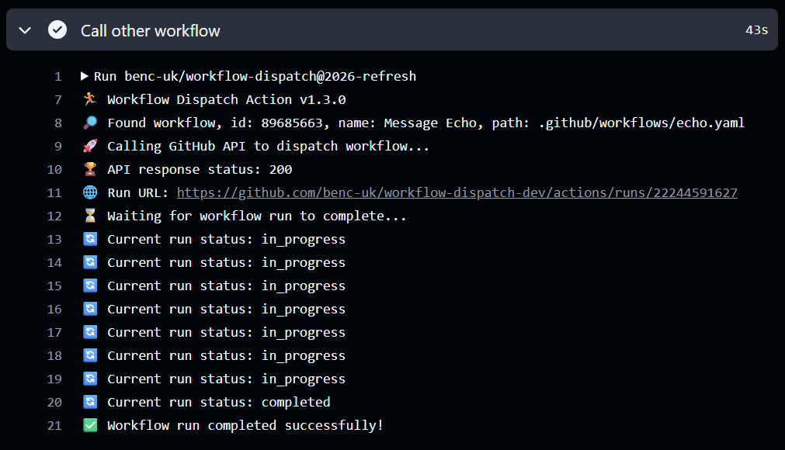

# GitHub Action for Dispatching Workflows

This action triggers another GitHub Actions workflow, using the `workflow_dispatch` event.  
The workflow must be configured for this event type e.g. `on: [workflow_dispatch]`

This allows you to chain workflows, the classic use case is have a CI build workflow, trigger a CD release/deploy workflow when it completes. Allowing you to maintain separate workflows for CI and CD, and pass data between them as required.



For details of the `workflow_dispatch` even see [this blog post introducing this type of trigger](https://github.blog/changelog/2020-07-06-github-actions-manual-triggers-with-workflow_dispatch/)

Note, GitHub now has a native way to chain workflows called "reusable workflows". See the docs on [reusing workflows](https://docs.github.com/en/actions/using-workflows/reusing-workflows). This approach is somewhat different from workflow_dispatch but it's worth keeping in mind.

The GitHub UI will report flows triggered by this action as "manually triggered" this might seem confusing at first, but it makes sense when you remember that the workflow_dispatch event is designed to be triggered manually by a user, and this action is simulating that manual trigger.

## 2026 Update

We finally have a way to get the details of the triggered workflow run, including the run ID and URL, which means we can now poll for the run status and wait for it to complete if required. This is a common ask and I'm glad to have added this feature after nearly 6 years!

## Action Inputs

### `workflow`

**Required.** The name, filename or ID of the workflow to be triggered and run. All three possibilities are used when looking for the workflow. e.g.

```yaml
workflow: My Workflow
# or
workflow: my-workflow.yaml
# or
workflow: 1218419
```

> _Note:_ If you want to reference the target workflow by ID, you will need to list the IDs with a REST API call `curl https://api.github.com/repos/{{owner}}/{{repo}}/actions/workflows -H "Authorization: token {{pat-token}}"`

### `inputs`

**Optional.** The inputs to pass to the workflow (if any are configured), this must be a JSON encoded string, e.g. `{ "myInput": "foobar" }`

### `ref`

**Optional.** The Git reference used with the triggered workflow run. The reference can be a branch, tag, or a commit SHA. If omitted the context ref of the triggering workflow is used. If you want to trigger on pull requests and run the target workflow in the context of the pull request branch, set the ref to `${{ github.event.pull_request.head.ref }}`.

### `repo`

**Optional.** The default behavior is to trigger workflows in the same repo as the triggering workflow, if you wish to trigger in another GitHub repo "externally", then provide the owner + repo name with slash between them e.g. `microsoft/vscode`.

- When triggering across repos like this, you **must** provide a `token` (see below), or you will get an _"Resource not accessible by integration"_ error.
- If the default branch in the other repo is different from the calling repo, you must provide `ref` input also, or you will get a _"No ref found"_ error.

### `token`

**Optional.** By default the standard `github.token`/`GITHUB_TOKEN` will be used and you no longer need to provide your own token here.

**⚠️ IMPORTANT:** When using the `repo` option to call across repos, you **must** provide the token. In order to do so, create a PAT token with repo rights, and pass it here via a secret, e.g. `${{ secrets.MY_TOKEN }}`.

This option is also left for backwards compatibility with older versions where this field was mandatory.

### `wait-for-completion`

**Optional.** Set to `'true'` to wait for the triggered workflow run to complete before finishing this action. The action will poll the run status every 5 seconds. Default is `false`.

### `wait-timeout-seconds`

**Optional.** The maximum time in seconds to wait for the triggered workflow run to complete before timing out. This only applies if `wait-for-completion` is set to `true`. Default is `900` seconds (15 minutes).

## Action Outputs

| Output       | Description                                         |
| ------------ | --------------------------------------------------- |
| `runId`      | The ID of the workflow run that was triggered       |
| `runUrl`     | The API URL of the workflow run that was triggered  |
| `runUrlHtml` | The HTML URL of the workflow run that was triggered |
| `workflowId` | The ID of the workflow that was triggered           |

## Example usage

```yaml
- name: Invoke workflow without inputs
  uses: benc-uk/workflow-dispatch@v1
  with:
    workflow: My Workflow
```

```yaml
- name: Invoke workflow with inputs & wait
  uses: benc-uk/workflow-dispatch@v1
  with:
    workflow: Another Workflow
    inputs: '{ "message": "blah blah", "something": true }'
    wait-for-completion: true
```

```yaml
- name: Invoke workflow in another repo with inputs
  uses: benc-uk/workflow-dispatch@v1
  with:
    workflow: my-workflow.yaml
    repo: benc-uk/example
    inputs: '{ "message": "blah blah", "something": false }'
    # Required when using the `repo` option. Either a PAT or a token generated from the GitHub app or CLI
    token: '${{ secrets.MY_TOKEN }}'
```
